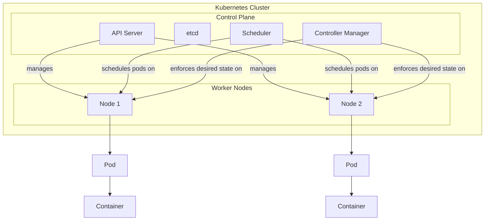

# Udemy Japan Test

### Log Analytics Workspaceについて

### Azure Cache for Redis

- C言語で書かれている
- キーに有効期限を設定しておく、頻繁にアクセスがないキーは消されていくよ

### App Service

- ASP.NETはVersion4.8まで
- それ以降は.NET5, .NET6, 7, 8 ,9と続くが中身は.NET Core

| アプリ環境        | ホスト  | ログレベル                                 | 保存場所                         | 詳細説明                                                     | 抽象的説明（ユーモア）                                       |
| ----------------- | ------- | ------------------------------------------ | -------------------------------- | ------------------------------------------------------------ | ------------------------------------------------------------ |
| **ASP .NET**      | Windows | エラー、警告、情報、詳細                   | ファイルシステム、Blobストレージ | .NET Framework 上で動作。IIS に完全依存し、System.Web 経由で豊富なログを取得可能 | 昔ながらの高級セダン。快適だが、それなりに車体が重くて移動に時間がかかる。 |
| **ASP .NET Core** | Windows | エラー、警告、情報、詳細                   | ファイルシステム、Blobストレージ | .NET Core 上で動作。Kestrel＋IIS リバースプロキシ構成。軽量かつ高速で、Windows 環境でもモジュール制御が可能 | スポーツカーの軽快さと高級感を併せ持つ。パーツを組み替えてチューンナップできる。 |
| **ASP .NET Core** | Linux   | エラー                                     | ファイルシステム                 | .NET Core のクロスプラットフォーム機能を活かし、Kestrel 単体で動作。Linux 標準のファイルログを利用 | 黒豹のような機敏さ。Windows の足かせから解放され、サーバールームを駆け回る。 |
| **Node.js**       | Windows | エラー (STDERR)、情報 (STDOUT)、警告、詳細 | ファイルシステム、Blobストレージ | V8 エンジン上で動作する JavaScript 実行環境。標準出力／標準エラーへのリダイレクトでログを収集 | 料理番組のキッチン。炒めたり煮たり好き放題できるが、煙も出るので換気（ログ管理）が必須。 |
| **Node.js**       | Linux   | エラー                                     | ファイルシステム                 | Linux コンテナやサーバーで稼働。シンプルに STDERR のみをキャプチャして障害情報を得る | 武士道精神のストイックさ。派手さはないが、不具合が起きたら一気に切り捨てる。 |
| **Java**          | Linux   | エラー                                     | ファイルシステム                 | JVM 上で動作するエンタープライズ向けランタイム。log4j/logback など豊富なロギングフレームワークに対応 | 学者の書斎。分厚い本（JAR）が並び、詳細な研究ノート（ログ）が散らかっている。 |

### Service Bus

| モード                        | メッセージ損失 | 重複排除     | 利用すべきケース                                     |
| ----------------------------- | -------------- | ------------ | ---------------------------------------------------- |
| **at-most-once** (Delete)     | あり           | 完全排除     | 重複が許されず、欠落は容認できるログ処理など         |
| **at-least-once** (PeekLock)  | なし           | 再試行で重複 | 欠落は許されず、再試行で二重処理を吸収できる業務向け |
| **exactly-once** (アプリ制御) | なし           | 排除         | 重複も欠落も許されないミッションクリティカル処理     |

### Kubernetes

